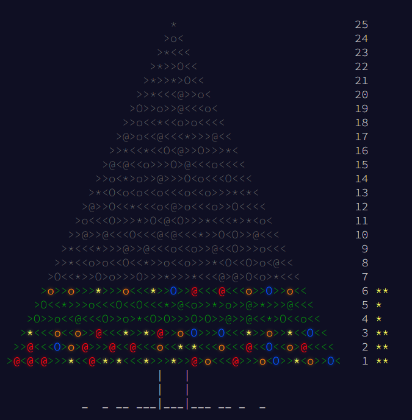

# 🎄 Advent of Code (2015) 🎄

[Advent Of Code](https://adventofcode.com/) [2015](https://adventofcode.com/2015/)

[](https://adventofcode.com/)
[](https://opensource.org/licenses/MIT)

---




## Ranking

```bash
  |   |                   1 1 1 1 1 1 1 1 1 1 2 2 2 2 2 2
  |   | 1 2 3 4 5 6 7 8 9 0 1 2 3 4 5 6 7 8 9 0 1 2 3 4 5
0 | 0 | * * * ■ ■ ° ° ° ° ° ° ° ° ° ° ° ° ° ° ° ° ° ° ° ° | 8
```

Key: * Both | ■ One | ° None |

| Silver ■ | Gold * |
| - | - |
| 2 | 3 |

<!-- https://github.com/marketplace/actions/aoc-badges -->
<!--  -->
<!--  -->
<!--  -->

## Solutions

- [Day 1](day01/README.md)
- [Day 2](day02/README.md)
- [Day 3](day03/README.md)
- [Day 4](day04/README.md)
- [Day 5](day05/README.md)

This repo contains my solutions to the [Advent of Code 2015](https://adventofcode.com/2015) using primarily [C#](https://docs.microsoft.com/en-us/dotnet/csharp/).

The code will likely be bad. :p

## Setup

- [dotnet-script](https://github.com/filipw/dotnet-script)

`dotnet tool install -g dotnet-script`

## Run

Any tests I write will likely just be asserts in each solution file.

How to run the solution file for each day depends on the language.

### C#

For C# solutions `dotnet script dayXX/solution.csx`
